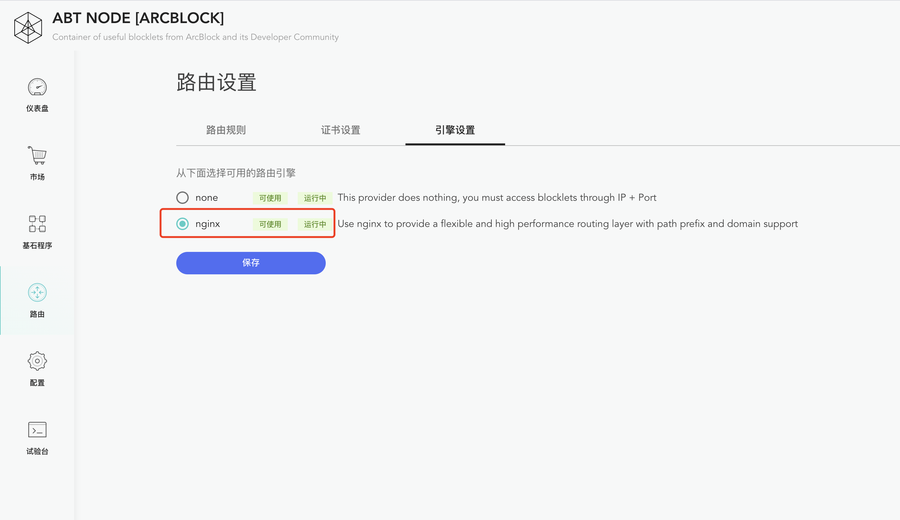

ABT Node 现在支持一种路由引擎：Nginx, ABT Node 没有内置 Nginx, 需要开发者自己安装。

## 版本要求

建议安装最新稳定版(stable version), 现在(2020-08-30)的最稳定版是 `Version 1.18`.

## 安装

因为 ABT Node 现在只能运行在 *nix 平台，所以这里只介绍在这些平台上如何安装 Nginx.

### Linux

[Nginx 官方文档](http://nginx.org/en/linux_packages.html)上提供了在各个 Linux 系统上使用包管理器安装方法：

- [RHEL/CentOS](https://docs.nginx.com/nginx/admin-guide/installing-nginx/installing-nginx-open-source/#installing-prebuilt-centos-and-rhel-packages)
- [Debian](https://docs.nginx.com/nginx/admin-guide/installing-nginx/installing-nginx-open-source/#prebuilt_debian)
- [Ubuntu](https://docs.nginx.com/nginx/admin-guide/installing-nginx/installing-nginx-open-source/#prebuilt_ubuntu)
- [SLES](https://docs.nginx.com/nginx/admin-guide/installing-nginx/installing-nginx-open-source/#prebuilt_suse)
- [Alpine](https://docs.nginx.com/nginx/admin-guide/installing-nginx/installing-nginx-open-source/#prebuilt_alpine)

### Mac OS

在 Mac 上推荐使用 [Homebrew](https://brew.sh/) 安装：

```bash
brew install nginx
```

### 从源码构建

当然，也可以从源码构建: https://docs.nginx.com/nginx/admin-guide/installing-nginx/installing-nginx-open-source/#sources

从源码构建时记得 HTTPS, gzip/unzip 等模块：

```nginx
./configure
--with-http_ssl_module
--with-http_gunzip_module
--with-http_gzip_static_module
...
```

## 启用 Nginx

安装 Nginx 后，只需要在 路由 -> 引擎设置 页面查看 Nginx 的`状态`, 如果 Nginx 的状态是 `可使用`，则就可以设置 Nginx 作为路由：

