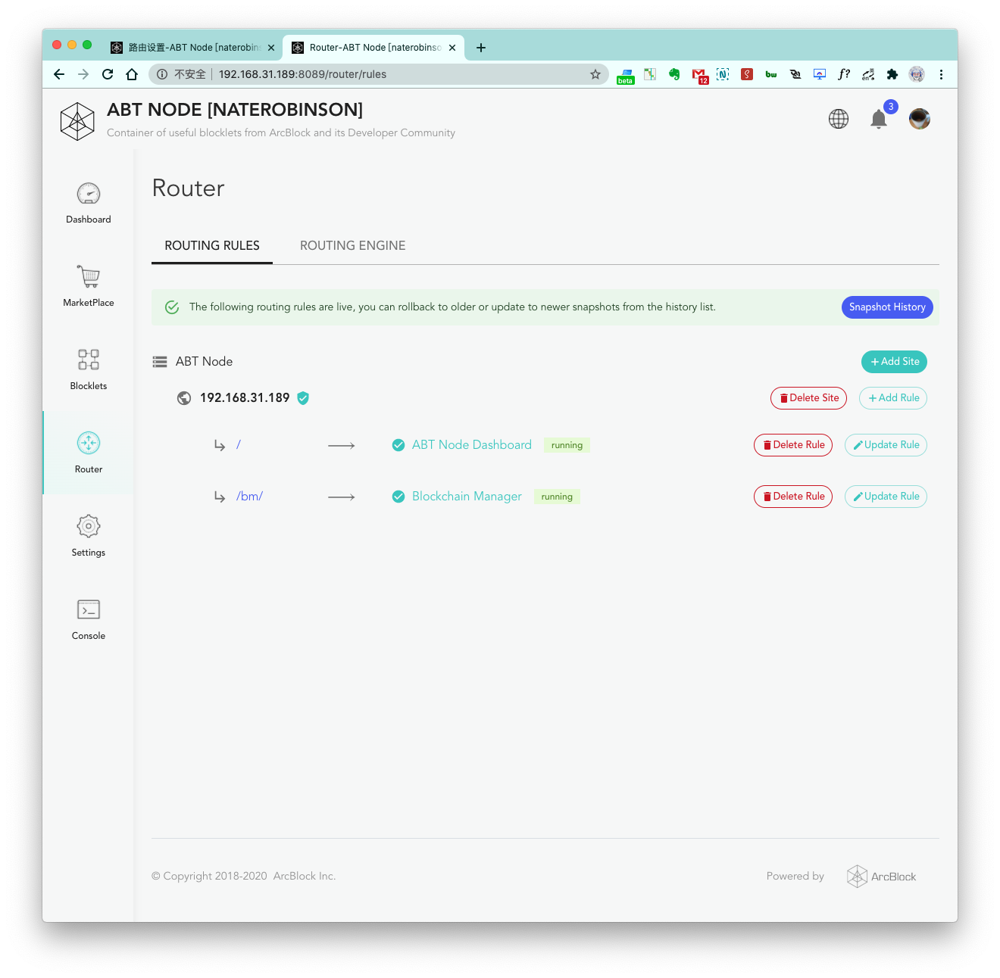

## What is Router?

Router allows you to manage the services running in ABT Node. You can set up a meaningful subdirectory for each
blocklet, which will make your blocklets more manageable. When a routing engine is running, a certain blocklet will be
loaded based on the subdirectory. For example, if I bind http://192.168.1.10/static-demo to Static Demo, the public
interface of Static Demo is accessible from http://192.168.1.10/static-demo instead of http://192.168.1.10:8091.

!