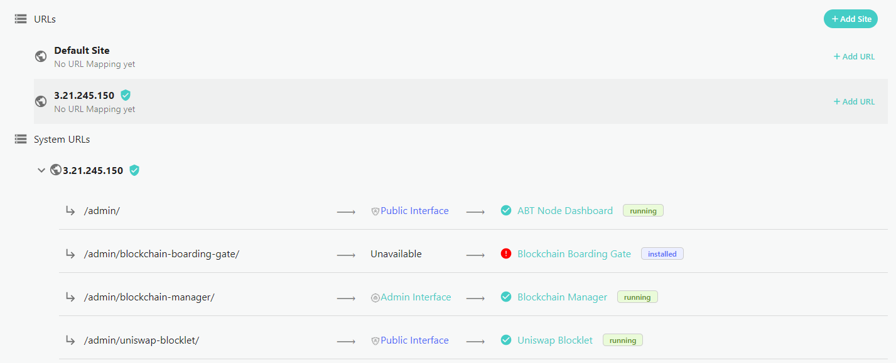
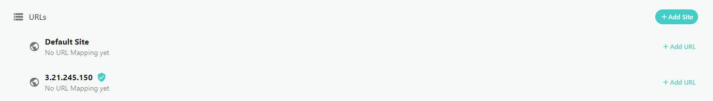
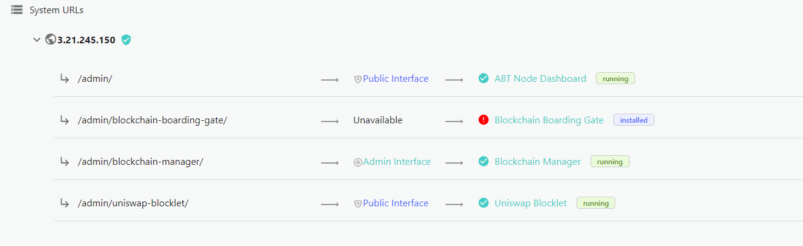
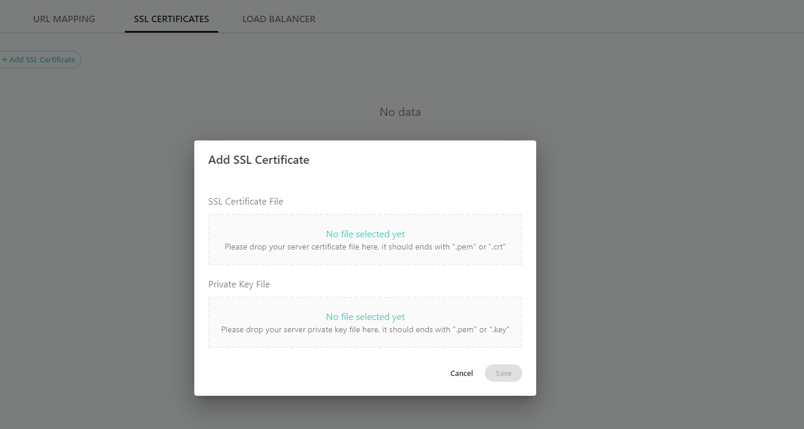
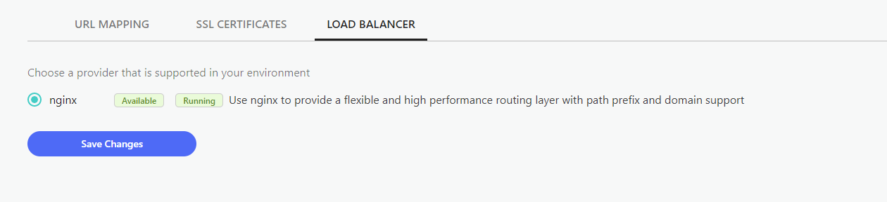

## What is ABT Node's Service Gateway?

The ABT Node **Service Gateway** allows you to manage the communication services running for your ABT Node including

## URL Mapping

ABT Node allows you to map your URLs for your ABT Node system and Blocklets redirects (permanent and temporary).

#### URLs

You can add new site and rules for specific IP addresses or domains that you own. Once a new site is added, you can create rules to assign a blocklet or service to your domain, or create custom temporary or permanent redirects.

#### System URLs

Each time you install a Blocklet from the marketplace, ABT Node will automatically generate a new subdireory that includes a system URL to ensure the node and the blocklet can communicate. System URLs also give you useful information about each blocklet including any available interfaces, the subdirectory, the current status of the blocklet and a link manage the blocklet. 

## SSL Certificates 

Add SSL Certificate files to your ABT Node using your SSL Certificate File and Private Key Files to secure services on your node. Today, ABT Node supports single domain SSLs and Wilcard SSLs to protect a domain (arcblock.io) and all its related subdomains (test.arcblock.io, shop.arcblock.io, etc). Please confirm with your SSL provider on the best SSL type for your project. Developers can also leverage Letsencrypt self-signed [Certificates for localhost](./certificates-for-localhost).

## Load Balancing 

ABT Node includes NGINX by default to give you a high performance routing layer that includes support for path prefixes and domains. _ABT Node will support additional application load balancers and elastic load balancers soon._

## Pub/Sub Gateway (coming soon)

ABT Nodes highly scalable pub/sub gateway for asynchronous messsaging.

