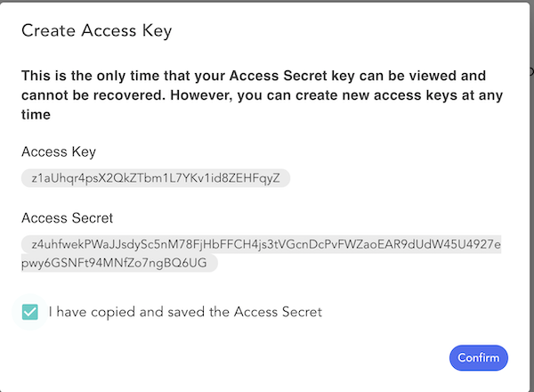

> 
This page is outdated and must be updated

Access keys are credentials for an Blocklet Server user. The *Access Keys* view allows you to create and delete access keys.

 

You can use access keys to access Blocklet Server API and perform various actions. Access keys consist of two parts:
- an access key ID (for example, z1WcsR61T7CMkFtEuMqdj3skQr3BBPumJ6b)
- a secret access key (for example, z3riGmHPsJiM6mNtmGCvLX7H1KGjY6QBLxHpc8AetarTquqyvD7vtN3c18388pqKiyKG65HjA77jCLqK2oNN3zmBB).

Authenticating your requests requires you to use your access key ID and secret access key together. Ensure you handle your access keys as securely as you do your user name and password.

 

> The secret access key can only be accessed at the time it is created. In the event that you lose your secret access key, you must delete it and create a new one.

The Access keys can be used to support the following user cases :
- To perform continuous deployment of a Blocklet by using `blocklet deploy` command in CI.
- To programatically configure the Blocklet Server by using `@abtnode/client` package.
